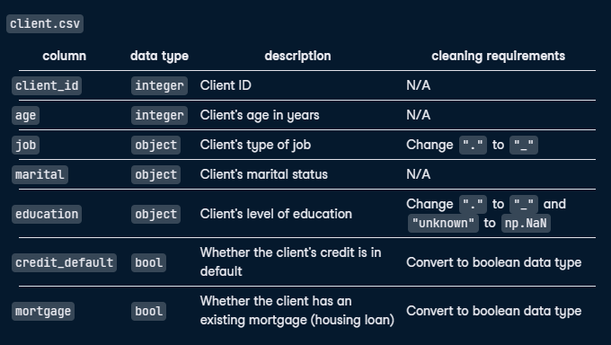
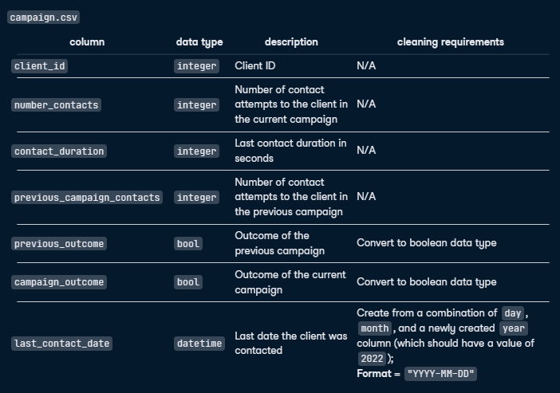
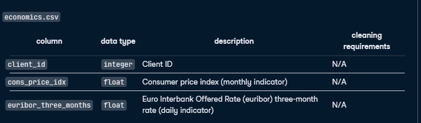

# Cleaning Bank Marketing Campaign Data
Personal loans are a lucrative revenue stream for banks. The typical interest rate of a two-year loan in the United Kingdom is around 10%. This might not sound like a lot, but in September 2022 alone UK consumers borrowed around £1.5 billion, which would mean approximately £300 million in interest generated by banks over two years!

I have been asked to work with a bank to clean the data they collected as part of a recent marketing campaign, which aimed to get customers to take out a personal loan. The bank plans to conduct more marketing campaigns going forward and wants me to ensure the data conforms to specific structure and data types so that it can then be used to set up a PostgreSQL database. This database will store the current campaign's data and allow data from future campaigns to be easily imported.

The bank has supplied me with a CSV file called "bank_marketing.csv", which I need to clean, reformat, and split into three final CSV files. Specifically, the three files should have the names and contents as outlined below:

## Project Instruction
Subset, clean, and reformat the bank_marketing.csv dataset to create and store three new files based on the requirements detailed in the notebook.

1. Split and tidy bank_marketing.csv, storing it as three DataFrames called client, campaign, and economics, each containing the columns outlined in the notebook and formatted to the data types listed.
2. Save the three DataFrames to CSV files, without an index, as client.csv, campaign.csv, and economics.csv respectively.

## Data Transformation Requirements

### Client

### Campaign

### Economics
